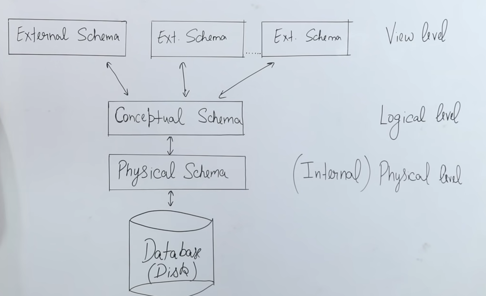

## Database System:
### Database:
- Collection of "related" data
- 2 Types:
	- **Structured database** has a pre-defined format and is highly specific. Ex: RDBMS -> stores in form of tables
	- **Unstructured database** has no format and may not be specific

### Database Management System:
- provides a collection of operations: insert, delete, update
- **management system** for the database
- Ex: SQL, Oracle, DB2

## File System vs DBMS:
### File system:
- inbuilt in the OS
- Ex CIFS, NIFS etc
- **hierarchical** form of data storage
- it gets all of the data in order to find and fetch a particular part of it and hence slows down the process and takes a LOT of space
- need to know the meta data for fetching something
- may not provide concurrency, no protocols for this
- no level based security

### DBMS:
- used when there is a client server architecture
- many users using the data
- meta data (attributes) is not known to the users 
- fetching of data is only done through queries
- has a set of protocols that allow for concurrency allowing multiple queries to be made at the same time
- provides role based access control (security) -> a role has a specific set of permissions for the database access
- reduces data redundancy

## 2-tier and 3-tier Architecture:
### 2-tier:
- 2 layers: 
	- Client: machine with an interface that helps fetching data from the DB (API)
	- Database server: processes the query
- easy maintainance
- bad security
- not scalable
### 3-tier:
- Client: has interface made using a high level language
- Application server/ Business layer: processes the query into a low level language, works as a intermediator
- Data layer: recieves the actual query in a low level language and sends the result back to the upper layers
- Easily scalable
- Secure as the user doesn't directly ineract with the data
- Maintainance is slightly harder but not a problem in the current scenario

## Schema in a database:
### Definition: 
- Logical representation of the database like in the form of tables or entities and relations
- user accesses data using the logical format
- part of the conceptual schema 
- can be implemented using SQL -> DDL (Data Definition Language) commands are used to implement/design the schema
- physical repressentaion is different

## 3 Schema Architecture / 3 Levels of Abstraction:

**MAIN MOTIVE: DATA INDEPENDENCE, User does not access the Data directly**

### External Schema:
- View level: how the particular user percieves the data
- provides security
- say for ex in a university the view for a student and a professor is different and one cannot access the other
- provides for authorisation
- Frontend devs

### Conceptual Schema:
- defines the structure of the data stored for the different views : BLUEPRINT
- taking the same example of the student and the professors: the type of data for each is in a different format
- student: roll number, name, age, marks
- professor: designation, name, age, salary
- Database Designers

### Physical Schema:
- way in which the physical storage of data is done on the disk
- DBAs (Database Admins) decide where the data is supposed to go

### Database(Disk):
- storage can be centralised or decentralised/distributed
- data is stored as files here whereas the upper layers store it in the form of tables

## Data Independence/ Data abstraction:
### Logical Data Independence:
- hides any changes made by users from other users using **views**
- conceptual schema will make sure the changes don't affect the user view level

### Physical Data Independence:
- change in physical schema doesnt affect conceptual schema
- so if say we shift the data from one physical disk to another it doesnt affect the name or the content or structure of the tables or databases

## Candidate Key and Primary Key:
- Tuples: rows
- Attributes: columns
- Key: an attribute from the table

### Candidate key:
- The set of attributes that can uniquely identify 2 tuples
- all attributes belong here
- Candidate keys - Primary key = Alternate keys

### Primary key:
- it is the attribute that is **UNIQUE and NOT NULL** and is chosen from one of the candidate keys
- in a practical scenario the values of the primary key are always system generated in order to satisfy the **not null** field
- so the user gets assigned the value rather than giving it as an input into the database
- only 1 primary key is allowed in the database table

## Foreign Key:
- Attribute / set of attributes that references to the **primary key** of the same table or another table (relation)
- maintains referential integrity
- let's take a look at an ex:

Student Table: (Referenced table)
==Roll no== | Name | Address
------------ | ------------ | ------------
1 | A | blr
2 | B | del
3 | C | bom

Course Table: (Referencing table)
course id | course name | ==roll no==
------------ | ------------ | ------------
c1 | DBMS | 1
c2 | Network | 2
c2 | Python | 3

- In the student table the ==Roll no== is the primary key and in the course table the ==roll no== is the **foreign key** which is used to refernce the student table's primary key
- 

- changes to the tables may or may not affect the other due to **referential integrity**.
