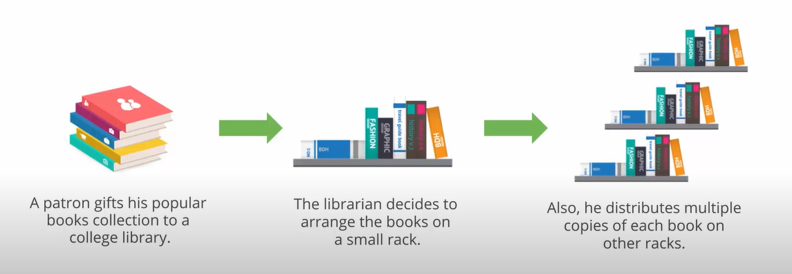

### 0. Big Data:
#### 0.1 Big Data?
**Data** that has **high**:
	- **V**olume
	- **V**ariety
	- **V**elocity
	- **V**alue
	- **V**eracity

#### 0.2 Where big data?
- Banking: Transaction Analysis
- Healthcare: Patient diagnosis
- Energy sector
- General Technology
- Consumer Technology
- Manufacturing

### 1. Introduction to Big Data and Hadoop:
#### 1.1 Intro to BD and Hadoop:
##### Traditional decision making process:
- based on what we think
- our experience and intuition - past experience and personal instincts
- rule of thumb - decisions based on predefined guidelines rather than facts
- Challenges in this process:
	- takes long time to come to a conclusion - loose competitive advantage :/
	- requires human intervention at various stages
	- lacks systematic linkage among strategy, planning, execution, reporting
	- limited scope of DA
	- obstructs companies from making fully informed decisions

#### 1.2 Intro to BD:
##### Solution? **big data analytics**
- decision making is based on already known facts
- comprehensive view of the entire picture that results from the analysis from various sources
- streamlined decision making
- can analyse unstructured data :)
- makes the decision making *fasssshhtt*
 
##### **Case study - google's self driving car:**
- car has numerous sensors that collect real time data 
- each car produces about 1GB/s of sensor data and that's 2 PB/year/car for 600hrs of driving (the data is already **HUGE** by now haha), yes not all is needed but we can classify the data in 3 categories here:
	- Technical data: from the sensors for the car's ML
	- Community data: crowd sourced data like traffic
	- Personal data: prefernces regarding driving, indoor car entertainment etcc...
- most power is used in consolidating the first 2 types of data and that too real time and making decisions in split seconds

#### 1.3 BDA Pipeline:
1. Data Ingestion Layer: data is categorised and prioritised here -> data flow is smooth in further layers
2. Data Collector Layer: transport of data from the ingestion layer to the rest of the pipeline. components are decoupled here
3. Data Processing Layer: specialise the data pipeline processing system. route the data to a different location and classify the data flow for the analytics to take place.
4. Data Storage Layer: we focus on where to store this HUGE data **efficiently**.
5. Data Query Layer: **active** analytical processing is done here. gather the data value to make it easy for the next layer
6. Data Visualisation Layer: data pipeline users are made to feel the value of the data here and make the findings well understood :)

#### 1.4 What is Big Data?:
##### Different types of data:
- Structured: data having defined data model, format and structure (Ex. Database)
- Semi-structured: textual data with some patterns, can be analysed (Ex. XML, spreadsheets)
- Quasi-structured: textual data but needs to be formatted using tools (Ex. Clickstream data from web browsers)
- Unstructured: no inherent structure and stored in different types of formats (Ex. PDFs, images, videos)
#### 1.5 4 V's of BD:
1. Volume: huge amount of data being produced everyday and is rising exponentially
2. Variety: data comes from a diverse range of sources in differnet forms. analytics tools are used to segregate them into groups
3. Velocity: data is not only large in terms of amount but also in terms of the speed of the incoming data
4. Veracity: refers to the trustworthiness of the data. due to descrepancies in the data the prediction might be inaccurate


#### 1.6 Challenges of traditional systems (RDBMS and Data Warehouses):
1. Data size is a concern even though it can be scaled upto a few exabytes
2. Unstructured data can't be processed :/
3. Growth rate of data generation is enourmous

**SOLUTION?**: use more computers (**distributed systems**) rather than one single highly powerful machine to perform the analysis

#### 1.7 Distributed System:
Model in which components located on networked computers communicate and coordinate their actions by passing messages to one another while processing a single job.

##### Challenges faced by distributed systems:
- high chance of system faliure
- limited bandwidth
- high programming complexity: difficult to sync data and process across parallel computers

**Solution?**: Hadoop :)

#### 1.8 Introduction to Hadoop:
Framework that allows distributed processing of large datasets across clusters of **commodity computers** using simple prog modules.

How hadoop solves the problems:
- Economical: can use ordinary computers for data processing
- Reliable: stores copies of data on diff machines and resistant to h/w faliure
- Scalable: can follow horizontal and vertical scaling
- Flexible: can store huge data and use later on

category| Traditional DBS| Hadoop
-|-|-
-|data stored on central location| initially distributes data to the systems and then runs computation on the nodes where the data is located located
-|data sent on run time| program goes to data not vice versa
data types| structured| multi and unstructured
processing| limited to 0| processing coupled with data
governance| standards and structure| loosely structured
schema| required on write operations | required only on read operations
speed| fast reads| fast writes
cost| s/w license| only support
resources| known entity| growing, complex, wide
best fit uses| Online Transaction Processing (OLTP), complex ACID transactions and operational data stores| data discovery, processing unstructured data and massive storage/processing

##### Hadoop Core Components:
- Processing: by frameworks like **MapReduce/Spark**
- Resource Management: by resource manager **YARN (yet another resource manager)**
- Storage: by **(HDFS) Hadoop Distributed File System**


#### 1.9 Components of a Hadoop Ecosystem - 1:
1. Hadoop Distributed File System (HDFS) : Data Storage
	- storage layer for hadoop
	- for distributed storage and processing
	- streaming access to FS data
	- provides file permission and authentication
	- CLI to interact with HDFS
2. HBase:
	- stores data in HDFS
	- NoSQL DB 
	- mainly used when u need **random, real-time, read/write access** to BD
	- support to high volume of data and high throughput
	- a table can have 1000s of cloumns
3. Sqoop: Data Ingestion
	- tool designed to transfer data b/w Hadoop and RDB servers
	- import data from RDBs like Oracle and MySQL to HDFS and vice versa
4. Flume: Data Ingestion
	- to ingest event data (streaming data, sensor data, log files etc)
	- for ingesting **streaming data** to HDFS
	- suitable for data from multiple systems
5. Spark: Data Processing
	- open src cluster computing framework
	- 100x faster performance than MapReduce
	- supports ML, Business Intelligence, streaming and batch processing
	- components:
		- Spark Core and Resilient Distributed Datastes(RDDs)
		- Spark SQL
		- Spark Streaming
		- MLlib
		- GraphX
6. MapReduce: Data Processing
	- also processes data
	- original hadoop based engine ie java based
	- based on **map and reduce** programming model
	- Hive n Pig are built on this model
	- commonly used
7.  Pig: Data Analysis
	- open soruce high level dataflow system
	- converts its script to MapReduce code
	- alternative to writing MapReduce code
	- for adhoc queries like filter and join 
8. Impala: Data Analysis
	- high performance SQL engine that runs on a Hadoop Cluster
	- ideal for interactive analysis
	- very low latency
	- data is modeled as a DB table
9. Hive: Data Analysis
	- abstraction layer on Hadoop
	- similar to Impala
	- best for data processing and performing ETL (extrac, transform, load)
	- executes queries using mapreduce 
10. Cloudera Search: Data Exploration
11. Oozie: Workflow/Co-ordination system to manage hadoop jobs
12. Hue (Hadoop User Experience): Data Exploration
13. Tableau: Data Visualisation

#### 1.10 Commercial Hadoop Distributions:
- Cloudera: CDH
- HortonWorks
- MAPR
- Amazon EMR (Elastic Map Reduce)
- Azure HDInsight: cloud based

BD Processing:
- Ingest: sqoop, flume
- Process: HDFS, MapReduce, HBase, Spark
- Analyze: Impala, Pig, Hive
- Access: HUE, Cloudera Search


### 2. Hadoop Architecture, Distributed Storage(HDFS) and YARN:
#### 2.1 What is HDFS?
- distributed file system
- provides data across Hadoop clusters
- cluster? : group of computers at work together
- why not traditional file system?:
	- more cost
	- less speed
	- less reliabiltiy
#### 2.2 Need for HDFS:
- solves the above issues:
	- open src: only support cost
	- high speed: read and write >1TB/s
	- multiple copies stored: reliability
- how it stores data:
	
	- similarly HDFS keeps multiple copies of a data blocks and keeps them in separate systems for easy access
#### 2.3 Regular FS vs HDFS:
Property|Regular FS|HDFS
-|-|-
size of data|small block (51B)|large block 128MB
acess to large data|suffers from disk I/O ops 'cause of multiple seeks|reads huge data sequentially in a single seek op
- how HDFS storage works:
	- 
	- no. of replicas can be altered by the admin
	- HDFS is a storage system for both i/p and o/p of MapReduce jobs
	- meta data controls the phy location and the replication of a block within a cluster
#### 2.4 Characteristics of HDFS:
1. Fault Tolerant
	- data is broken down into **blocks** and then **duplicated and ditributed** throughout the cluster
	- **default replication factor: 3** (can be changed by admin)
	- therefore data is highly available and fault tolerant
2. Scalable
	- 2 scalability mechanisms:
		- vertical: larger hardware
		- horizontal: provides unlimited supply of computing added to cluster
3. Rack-aware
	- **rack:** collection of machines (40-50) connected using the same network switch
	- if the switch is down then none of the computers can be accessed
	- introduced to solve this issue by:
		- increasing **availability** of data block **across multiple racks**
		- better cluster performance by **segmenting read ops** across multiple racks
	- communication is faster b/w nodes in same rack than in different racks
	- info on location of data nodes in rack is stored in NameNode
4. Support for heterogeneous clusters 
	- each data directory can be configured based on the usage 
5. Built for large data sets
	- small blocks result in more requests to fig out where it can be found -> increasing the network traffic
	- having a very large block -> longer data processing time
	- to overcome both these -> default size of data block is **128MB** (can be configured)
#### 2.5 HDFS Architecture and components:
- high availabitlity architecture
- master - slave architecture
- ">=" 2 machines : configured as **NameNodes**
- at one point only 1 namenode is in active state (master node) -> responsible for all the client ops in the cluster
- standby node is a slave maintaining state to provide **fast fail-over** if active namenode fails
- master node -> ensures data required for operations is loaded and segregated into data blocks in the **DataNodes** (slave nodes)
- data node -> serves read/write requests, creates, replicates, deletes on instruction from name node
- the 2 namenodes are kept in sync with each other using **shared edit logs (metadata)**
- active name node updates the **logs** -> metadata info about storage -> done with namespace modification like block locations, status of namenode, etc.
- fail-over process is manual and needs to be done by the admin
- automatic fail-over can be done by other services like -> apache zookeeper
- zookeeper (Zookeeper Fail Controller) -> keeps an active session open with the active namenode by pinging it with the **health check command** if the node is crashed/frozen the health monitor will mark it as unhealthy and elect a new namenode
#### 2.6 High Availabitlity Cluster Implementation:
- 2 ways:
	1. Quorum-based:
		- uses a QJM(quorum journal manager)
		- stand-by node is kept synced with the active node through -> group of separate daemons -> **Journal Nodes**
		- daemons: processes that start with the system and wait for the requests from the client processes
		- each daemon has it's own JVM
		- when a namespace is changed it logs the modification to a majority of the journal nodes
		- when the standby node seeds the edits it applies the changes to it's own namespace
	2. Shared storage using NFS:
		- sync is maintained using a **shared directory** on a shared storage device
##### NameNode:
- core component of an HDFS cluster
- only **ONE** namenode in the entire cluster
- **maintains and executes the FS Namespace operations** : opening, closing, renaming of files and directories 
- the namespace image and edit logs store info of the data and metadata
- determines the **linking of blocks to the datanodes**
- it is a single point of faliure
##### DataNode:
- a multiple instance server
- can be N number of datanodes depending on the type of network and storage system
- store and maintain data blocks
- namenode provisions the data blocks to the datanodes based on the type of job submitted by the client
- stores, retrieves blocks when client or namenode asks for it
- read/write requests and performs block creation, deletion and replication on instruction from namenode
##### ZooKeeper:
- allows distributed processes to co-ordinate with each other
- servers maintain an in-memory image of state, snapshots, transaction logs in a persistent store
- Faliure Detection:
	- on system crash the zookeeper session expires notifying other namenodes to trigger the fail-over
- Active NameNode election:
	- another node may take an exclusive lock in zookeeper indicating that it should be elected as the namenode
#### 2.7 HDFS Component FS Namespace:
- hierarchy of where the data is stored
- data can be stored in files
- follows a hierarchical file system with directories and files
- supports ops like : create, remove, move, rename
##### NameNode Operations:
- maintains persistent 2 files
	- Edit log: transaction log
		- records every change in FS metadata (new file, removed file, modified file)
		- **stored in the local file system**
	- Fsimage: namespace image
		- mapping of blocks, files and file sys properties are stored here
		- also stored in the local file system of the namenode
-  when new nodes join a cluster -> metadata loads blocks from datanode into its memory and startup
- on startup the Fsimage and the edit log are retrieved from local FS -> updates and stores a copy on the FS as a checkpoint
- **large no. of small files >> small no. of large files** : space needed by metadata therefore small no of large files is preferred :)
#### 2.8 Data block splitting:
- File -> blocks -> stored and replicated in datanodes
- name and loc of file blocks -> datanode ✔
- 128 MB → reduces parallelism as no. of blocks/file ⬇
- each map task operates on 1 block → tasks < nodes in cluster → **bad performance :(**  (unless there are more files or large files)
- helps shield users from storage subsystem details
##### Block replication architecture:
- replication of block in multiple datanodes
- usually data split in **part0 and part1**
- done on multiple datanodes
- in case of error in one node the job tracker service submits the job to the other datanode server
- job tracker is in namenode server
##### Replication methods used:
- all blocks except last one are of same size
- replication factor is configured at the cluster level
- namenode receives a **heartbeat** and **block report** from datanode
- heartbeat : makes sure datanode is functioning properly
- block report : lists blocks on the datanode
#### 2.9 Data Replication Topology:
- each data is replicated **3 times**
- **replica_1:** same node as client
- **replica_2:** different rack from replica_1
- **replica_3:** same rack of replica_2 but different node

##### HDFS Access:
- JAVA API / Python and C Wrapper
- Web GUI through web browser
- FS Shell for executing HDFS commands

#### 2.10 HDFS Command Line:
1. Copy file from LOCAL DISK to HDFS User Directory:
``` sh
hdfs dfs -put /local_file_path /hdfs_file_path
```
2. Display list of contents of dir:
``` sh
hdfs dfs -ls /dir_path
```
3. Create dir under home dir:
```sh
hdfs dfs -mkdir /path/dir_name
```
4. Delete the dir and it's contents:
``` sh
hdfs dfs -rm -r dir_name
```
- HUE file browser: UI for the same things as above

#### 2.11 Intro to YARN:
- **Y**et **A**nother **R**esource **N**egotiator
- Split up functionality of resource management
- job scheduling and monitoring into diff daemons
- resource manager (RM) or application manager (AM)
- monitors, manages workload
- maintains multi tenant env
- manage high availability feature of hadoop
- implement sec protocols

#### 2.12 YARN Advantages:
Single-cluster approach:
- higher cluster utilization
- lower operational cost
- reduced data motion
- YARN and Hadoop are completely independent of each other (yarn → resources for running application; hadoop → storage)

#### 2.13 YARN Architecture:
- 

### 3. Data ingestion into Big Data Systems and ETL (extract, transform and load):
### 4. Distributed Processing: MapReduce Framework and Pig:
### 5. Apache Hive:
### 6. NoSQL DB - HBase:
### 7. Basics of Functional Programming and Scala:
### 8. Apache Spark - Next gen BD Framework:
### 9. Processing RDDs:
### 10. Spark SQL - processing DataFrames:
### 11. Spark MLlib - Modelling BD with Spark:
### 12. Stream Processing Frameworks and Spark Streaming:
### 13. Spark GraphX